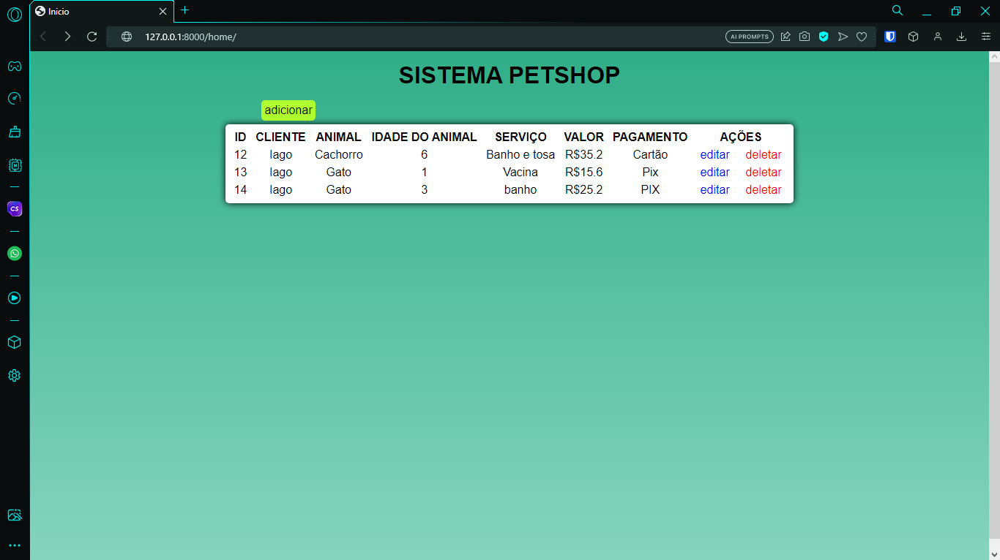
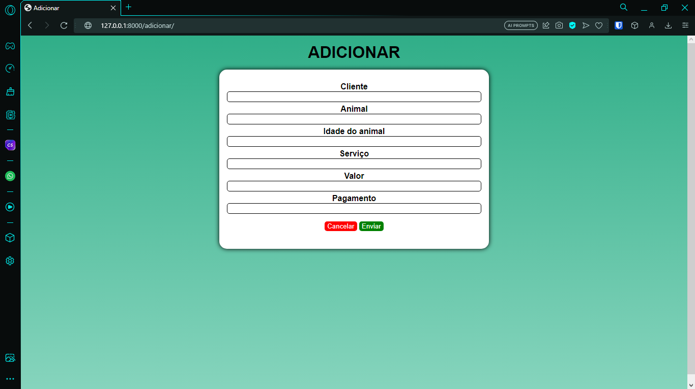

<h1 align="center"> Petshop - Django 🐶 </h1>

<div align="center">
  
  
  
  
</div>

# Índices 🗂
* [Sobre](#sobre-)
* [Screenshots](#screenshots-)
* [Como usar](#como-usar-)

# Sobre ☄

Este projeto foi uma a entrega de uma avaliação da disciplina de Banco de Dados II da minha faculdade. Com o intuinto de implementar na prática o uso do banco de dados.

<hr/>

# Screenshots 📸



# Como usar 💻

1. Instale as dependências do projeto
```
$ pip3 install django
```

2. Clone o repositório
```
$ git clone https://github.com/danonep2/Petshop-Django.git
```

3. Dentro da pasta execute o seguinte comando para iniciar 
```
$ python3 manage.py runserver
```

E pronto! O projeto já deve está executando no localhost.

<hr>
<div align="center">

Criado por [Iago Amorim](https://github.com/danonep2).

</div>
 
